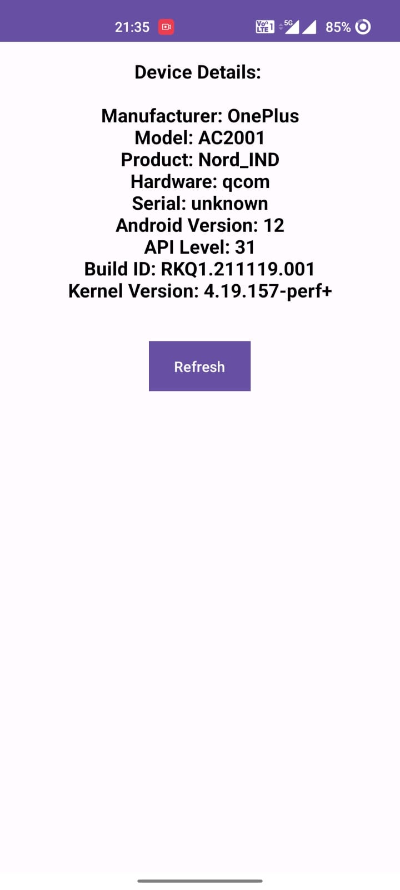

# Device Details App

This Android app displays various details about your device such as the device name, model, manufacturer, OS version, etc.

## Getting Started

1. Clone this repository onto your local machine.
2. Open the project in Android Studio.
3. Build and run the app on your Android device or emulator.

## Features

- Displays device name, model, manufacturer, OS version, etc.
- Provides an easy-to-read interface to view device details.

## Screenshots

https://user-images.githubusercontent.com/83538805/235363767-02fdd3a3-a532-4fa1-a90d-7f31bf49795a.mp4

## Built With

- Java
- Android Studio

## Authors

- John Doe

## License

This project is licensed under the MIT License - see the [LICENSE](LICENSE) file for details.
